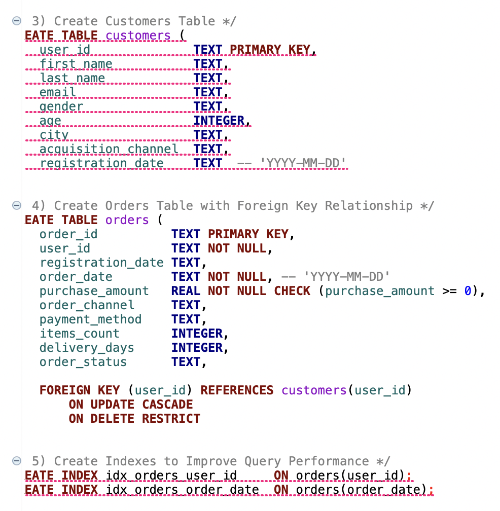
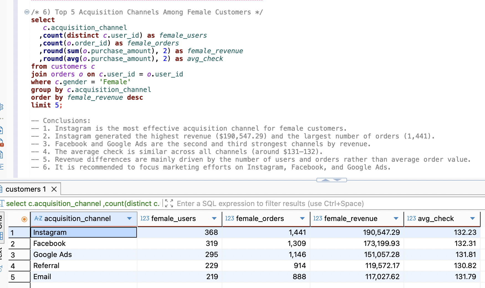
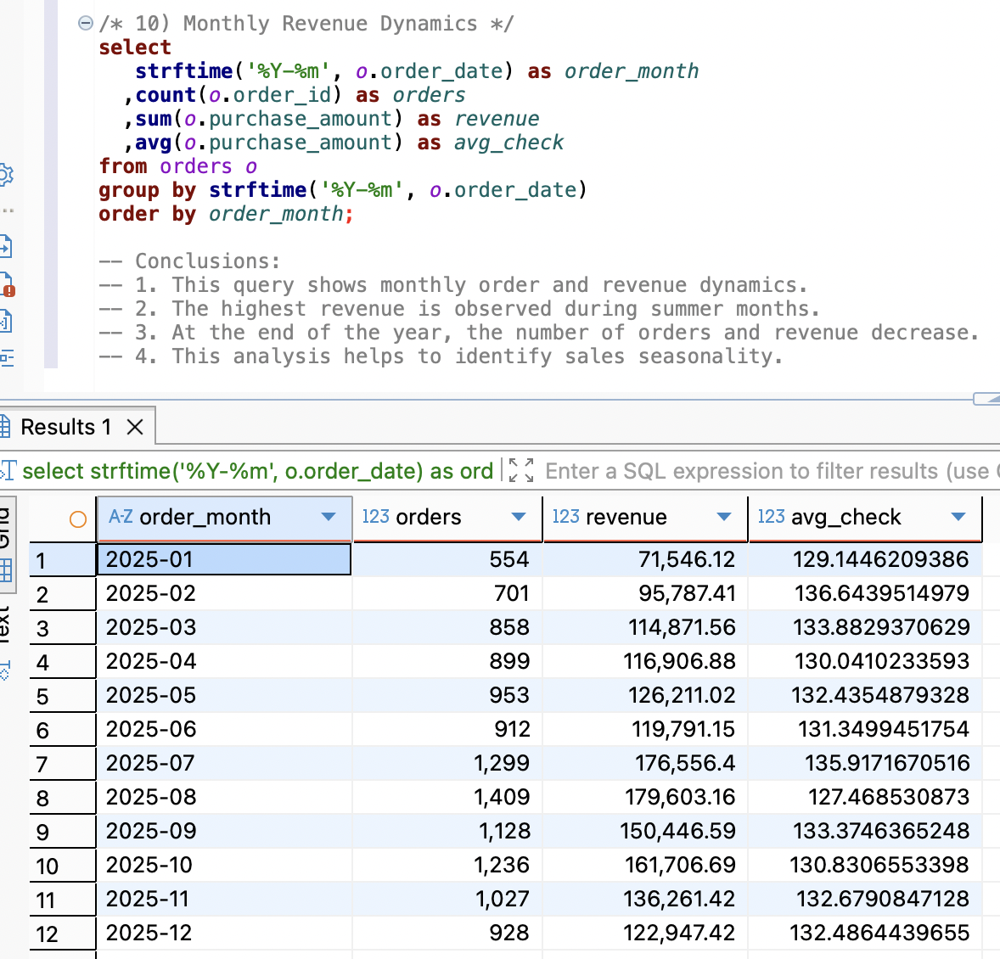

# Customer Acquisition Analysis

SQL project focused on customer acquisition, order behavior, revenue performance, and sales channel analysis.

## Project Overview

This learning project demonstrates how SQL can be used to build a simple relational database, connect customer and order data, analyze acquisition channels, and identify revenue patterns.

The project includes database creation, relationships between tables, indexes for query performance, customer segmentation, acquisition analysis, order channel analysis, payment method analysis, and monthly revenue dynamics.

## Business Goal

The goal of this project was to:

- Analyze customer acquisition channels
- Compare channel performance by revenue and number of orders
- Analyze female customer acquisition separately
- Evaluate order channels
- Compare payment method performance
- Analyze monthly revenue dynamics
- Identify business patterns that could support marketing and sales decisions

## Database Structure

The analysis is based on two related tables:

### customers

Contains customer-level information, including:

- user ID
- name
- gender
- age
- city
- acquisition channel
- registration date

### orders

Contains transaction-level information, including:

- order ID
- user ID
- order date
- purchase amount
- order channel
- payment method
- items count
- delivery days
- order status

The tables are connected through `user_id`.

A foreign key relationship was created from `orders.user_id` to `customers.user_id`.

Indexes were also created on:

- `orders.user_id`
- `orders.order_date`

to improve query performance.

## SQL Skills Used

- CREATE TABLE
- PRIMARY KEY
- FOREIGN KEY
- JOIN
- WHERE
- GROUP BY
- ORDER BY
- LIMIT
- COUNT
- COUNT DISTINCT
- SUM
- AVG
- ROUND
- strftime()
- Index creation
- Data aggregation
- Customer segmentation
- Revenue analysis

## What I Did

- Created the `customers` and `orders` tables
- Defined primary and foreign key relationships
- Added indexes to support faster joins and date-based analysis
- Joined customer and order data
- Analyzed acquisition channels
- Segmented female customers for channel performance analysis
- Compared order channels
- Analyzed payment methods
- Calculated monthly order and revenue dynamics
- Summarized business conclusions directly from SQL query results

## Business Questions

The SQL analysis answered questions such as:

1. Which acquisition channels generate the highest revenue?
2. Which acquisition channels perform best among female customers?
3. Which channels generate the largest number of orders?
4. How do average order values differ between acquisition channels?
5. Which order channels perform best?
6. Which payment methods generate the most revenue?
7. How do orders and revenue change from month to month?

## Key Insights

### Female Customer Acquisition

Among female customers:

- **Instagram** was the strongest acquisition channel.
- Instagram generated **$190,547.29** in revenue.
- It generated **1,441 orders** from **368 female customers**.
- Facebook ranked second with **$173,199.93** in revenue.
- Google Ads ranked third with **$151,057.28** in revenue.
- Average order value was relatively similar across the leading channels, at approximately **$131–132**.

This indicates that the revenue difference between acquisition channels was driven mainly by customer and order volume rather than by major differences in average order value.

### Monthly Revenue Dynamics

Monthly analysis showed clear changes in order volume and revenue throughout 2025.

- Revenue increased from **$71,546.12 in January** to a peak of **$179,603.16 in August**.
- August also had the highest order volume, with **1,409 orders**.
- July was another strong month with **1,299 orders** and **$176,556.40** in revenue.
- Revenue decreased toward the end of the year, reaching **$122,947.42 in December**.
- Average order value remained relatively stable compared with the larger changes in total revenue and order count.

The results suggest that sales performance was influenced more strongly by order volume than by changes in average order value.

## Database Schema

## Acquisition Channel Analysis

The following query analyzes the top acquisition channels among female customers.

## Monthly Revenue Analysis

The following query analyzes monthly order and revenue dynamics.

## SQL File

[View the full SQL analysis](queries/customer-acquisition-analysis.sql)

## Dataset Note

The project uses customer and order data for learning purposes.

The full source datasets are not included in this repository. The repository focuses on the SQL logic, database structure, query results, and analytical conclusions.
